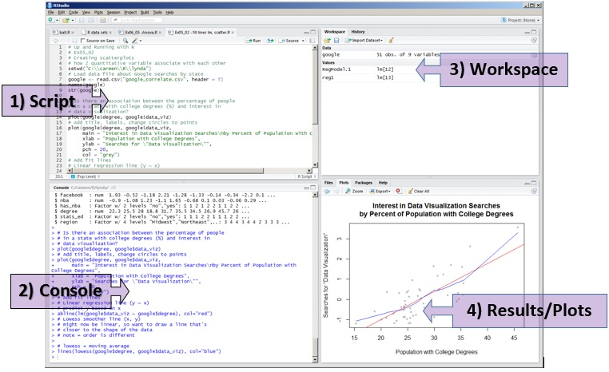

```{r setup, include=FALSE}
knitr::opts_chunk$set(echo = TRUE, include = TRUE, eval = TRUE)
```


# RStudio

RStudio es una interfaz conocido como *entorno de desarrollo integrado* o *IDE* que nos permite interactuar con el lenguaje de programación **R**. La ventana de RStudio se conforma de 4 cuadrantes:

```{r, fig.align='center', out.width="400", echo=FALSE}

```


1. Editor de scripts. El cuadrante que tiene la función de escribir y redactar el código o scripts de nuestros programas. En este cuadrante los comandos **NO** se ejecutan de forma automática al presionar la tecla de *Enter*

2. Consola de R. Es la consola o termnal en donde se está ejecutando el lenguaje R. Aquí los comandos escritos se ejecutan de manera automática al presionar la tecla de *Enter*

3. Entorno de variables. En este cuadrante se almacenan o guardan las variables, funciones u objetos (listas, tablas,...) dervivados de los análisis   

4. Utilidades. Desde este cuadrante podemos accesar a los archivos de nuestra computadora en la pestaña de **Files**; gráficas generadas durante los análisis en la pestaña de **Plots**; lista e información de los paquetes instalados en la pestaña **Packages**; manuales de los programas instalados **Help**

Desde el menú principal puedes crear, salvar o abrir un nuevo script. Asímismo, es posible buscar funciones, comandos u objetos dentro del script dando click en la lupa.

# Tipos de datos

Una de las principales funciones de R es el manejo y análisis de una diversidad de datos. Para ello R los clasifica en tres principales grupos:

- Numéricos
- Lógicos
- Caracteres

## Datos numéricos

Existen dos principales tipos de datos nuéricos: los números **enteros** o *integer* con valores positivos o negativos y los números **decimales** o *numeric* con valores positivos o negativos:

```{r, eval=FALSE}
#Número entero positivo
4

#Número entero negativo
-36

#Número decimal positivo
7.65

#Número decimal negativo 
-5.47
```

Con los valores numéricos es posible realizar todo tipo de operaciones algebraicas:

```{r}
#Suma
3+4

#Resta
100-60

#Multiplicación
9.7*6

#División
450/9

#Potencias 
2^5

#Raices
sqrt(121)

#Logaritmos
log10(100)
```

## Datos lógicos
Son datos que toman el valor de una variable dicotómica, es decir con dos categorías: verdadero *TRUE* (T) o falso *FALSE* (F). También se le conoce como valores *boleanos* o *logical*. Siempre se esciben con letras MAYUSCULAS

```{r}
#Valor verdadero
TRUE
#Valor verdadero abreviado
T

#Valor falso
FALSE
#Valor falso abreviado
F
```

## Caracteres
Los caracteres o *character* representan texto que comprende letras, palabras, frases o enunciados. Para ingresar un caracter es importante inseratrlo entre comillas:

```{r}
#Letra
"W"

#Palabra
"Variable"

#Frase
"Linea de codigo"

#Enunciado 
"Esta linea de codigo se escribe entre comillas"
```

Una manera de verificar el tipo o la clase de los datos es empleando la función o comando `class()`

```{r}
#La función class() para conocer el tipo de datos
class(3)
class(-5.4)
class(TRUE)
class(FALSE)
class("w")
class("Una cadena de caracteres")
```

Un caso especial son los datos *faltantes*, a los cuales se les asigna el nombre **NA**.

## Los comandos paste() y paste0()
En algunas ocasiones nos resulta útil unir o concatenar datos para formar una cadena o *string*. Para ello, R nos ofrece dos funciones o comandos:
La función `paste()` permite combinar datos de diferente clase (numéricos, lógicos y de texto), separando cada elemento con un espacio en blanco:

```{r}
#Cada elemento de la función paste() debe separarse con una coma
paste("El número atómico del oxígeno es", 8, "porque contiene", 8, "protones en el núcleo")
paste("Si el resultado de la operación es", TRUE, "entonces puedes terminar el trabajo de hoy")
```

La función `paste0()` de manera similar concatena valores de cualquier clase pero **omitiendo** el espacio en blanco. Todos los elementos quedan juntos
```{r}
#De manera similar a la función paste(), debed de separar los valores con comas
paste0("Este", "mensaje", "no", "se", "puede", "leer")
paste0(8575, "entre", 2)
paste0("../labcanoctocat/octocat.txt", "/archivos.txt")
```


# Variables
Una variable es un espacio en la memoria de la computadora en donde se almacenan datos de cualquier tipo. Para crear o declarar una variable se utilizan los siguientes signos de asignación:

```{r}
#Método tradicional
numero <- 2
texto <- "Pablito clavo un clavito"
logico <- TRUE

#Método no tradicional
numero = -1
texto = "Tres tristes tigres"
logico = FALSE
```

Se recomienda que utilices el método tradicional para evitar confusiones al momento de ingresar opciones en las funciones (más adelante).  
Las variables que declares se almacenan en el cuadrante 3 que corresponde al **Entorno de variables**.  
Con las variables numéricas es posible realizar las operaciones algebraicas previamente mencionadas:

```{r}
#Como primer paso, declara las variables
numero_1 <- 203
numero_2 <- 64
```

Una vez que declares una variable, es posible que realices operaciones algebraicas entre ellas. Además, es posible que verifiques el tipo de dato que almacena la variable y las concatenes:

```{r}
#Declara las variables
galon <- 3.785
litros <- 5
conv <- litros/galon

#Verifica la clase de cada variable
class(galon)
class(litros)
class(conv)

paste("Ayer compré", litros, "litros de nive de limon o", conv, "galones")
```


<blockquote class="blockquote">
**Ejercicio 1**  
1. Declara o crea cuatro variables que se llamen *altura* con un valor **1.50**, *masa* **47**, *unidad1* **metros** y *unidad2* **kilogramos**  
2. Obten el índice de masa corporal dividiendo la masa entre el cuadrado de la altura y almacena este valor en una nueva variable llamada **IMC**  
3. Verifica la clase que tienen las variables *altura*, *masa*, *unidad1* e *IMC*  
4. Imprime el mensaje *El sujeto sano 1 tiene una altura de 1.50 metros, una masa de 47 kilogramos y un IMC de x* usando los valores de las variables
</blockquote>

# Datos complejos
En R puedes manejar estructuras de datos más complejas. Esto es útil al momento de analizar tablas, matrices o listas de datos. Las principales estructures complejas de datos son:

- Vectores
- Matrices
- Data frames
- Listas

# Vectores
Los vectores son grupos de datos acomodados en **una sola dimensión**. Pueden ser descritos como una lista de datos numéricos, lógicos, de texto o combinaciones entre ellos. Para crear un vector utiliza la función `c()` y dentro del parentesis coloca los datos separados por comas:

```{r}
#Crea un vector con datos numéricos
c(1, 3, 5, 7, 9, 11)
#Con datos lógicos
c(TRUE, TRUE, TRUE, FALSE, FALSE, FALSE)
#Con datos de texto
c("gato", "leon", "puma", "jaguar", "ocelote", "tigre")
#Combinando datos
c("mama", 1.65, "papa", 1.57, "hermano", 1.74)
```

Es posible declarar una variable que contenga datos dentro de un vector:
```{r}
#Declara una variable para almacenar el vector
volumenes <- c(2.3, 4.5, 9.0, 10.6, 1.3)
volumenes

escencias <- c("lavanda", "limon", "neroli", "gardenia", "bergamota", "vainilla")
escencias

visitas <- c(TRUE, FALSE, FALSE, TRUE, FALSE)
visitas
```

Dentro de un vector se pueden almacenar otros vectores. En este caso R combina los vectores para formar un superverctor:
```{r}
#Crea un vector con vectores como elementos
localizaciones <- c(c("Mexico", "Guatemala", "Belice", "Canada", "EUA"), 
                    c("Guadalajara", "Tikal", "Belmopan", "Toronto", "Phoenix"), 
                    c(123.2, 125.3), 450.4, 673.7, 987,3)
localizaciones
```

## Propiedades de los vectores
Los vectores al ser listas de datos tienen asociadas ciertas propiedades que son útiles al momento de de analizar datos. Por ejemplo, **la clase** de datos que contiene se obtiene con la función `class()`:
```{r}
class(volumenes)
class(escencias)
class(visitas)
class(localizaciones)
```

El número de elementos que contiene el vector o **longitud** se obtiene con la function `length()`:
```{r}
length(volumenes)
length(escencias)
length(localizaciones)
```

Las veces que se repite un elemento en el vector, o **proporción**, se obtiene con la funcion `table()`:
```{r}
table(volumenes)
table(localizaciones)
table(visitas)
```

Cuando hay repetición de datos, aquellos denominados como **unicos** se obtienen con la función `unique()`:
```{r}
#Crea un vector con datos repetidos
calificaciones <- c(4, 5, 8, 8, 9, 6, 6, 6, 3, 10, 3, 3, 2, 2, 8)
#Obten los valores unicos del vector
unique(calificaciones)
```

Para **ordenar** los elementos de un vector (numerico o de texto) se emplea la función `sort()`:
```{r}
#La funcion sort() ordena los elementos de forma ascendente por default
sort(calificaciones)
sort(escencias)
sort(localizaciones)

#Para ordenar de forma descendente, coloca la opción decreasing = T
sort(calificaciones, decreasing = T)
sort(escencias, decreasing = T)
sort(localizaciones, decreasing = T)
```

## Manipulación de vectores
Al trabajar con datos, resulta útil extraer elementos de un vector de acuerdo a su posición dentro del vector o a un criterio. A esta operación de extracción se le conoce como *subset* y analizaremos el primer caso.
Los elementos dentro de un vector se encuentran numerados o indexados. Al número que hace referencia a la posición de los elementos se le conoce como **índice**. La numeración siempre comienza desde **1**.  
Para extraer elementos de un vector de acuerdo a su **posición** es necesario colocar entre corchetes `[]` la posición del elemento que queremos extraer:

```{r}
#Crea un vector con n elementos
simpson <- c("Marge", "Homero", "Lisa", "Bart", "Maggie", "Ned", "Ines", "Skinner", "Krusty", "Magda")
#Extrae el cuarto elemento del vector
simpson[4]
#Extrae el séptimo elemento del vector
simpson[7]
```

Para extraer múltiples elementos de un vector, dentro de los corchetes se tiene que añadir los índices de los elementos a extraer dentro de un vector:
```{r}
#Extrae el primer, tercer, cuarto y octavo elemento del vector
simpson[c(1, 3, 4, 8)]
```

Para extraer elementos con índices consecutivos basta con indicar el indice de incio y de fin separados por `:` 
```{r}
#Extrae del primer al quinto elemento del vector
simpson[1:5]
#Extrae del tercer al sexto elemento del vector
simpson[3:6]
```

Con respecto a la extracción de datos que cumplen un criterio, basta con escribir dentro de los corchetes el valor exacto que deseamos extraer empleando la siguiente sintaxis:
```{r}
simpson[simpson == "Marge"]
```

El símbolo que acabamos de utilizar se le conoce como **operador relacional** y en R existen los siguientes:
- *Es igual* == 

- *No es igual* != 

- *Es mayor* > 

- *Es menor* <

- *Es mayor o igual* >= 

- *Es menor o igual* <= 

El resultado de emplear un operador relacional será un valor o dato lógico. Cuando hacemos *subseting* de elementos de un vector utilizando este método, se seleccionarán aquellos datos que cumplan con la condición, es decir, sean **TRUE**

```{r}
#Genera un vector con 20 elementos numéricos
numeros <- c(1:20)
#Extrae los valores mayores a 5
numeros[numeros > 5]
#Extrae los valores menores a 17
numeros[numeros < 17]
#Extrae los valores mayores o igual a 10
numeros[numeros >= 10]
#Extrae los valores menores a 12
numeros[numeros <= 12]
#Extrae los numeros distintos a 15
numeros[numeros != 15]
```

Cuando requerimos que se cumplan dos o maás condiciones debemos emplear los operadores **|** O, **&** Y:
```{r}
#Extrae los datos entre 10 y 15. Es decir, mayores a 10 y menores a 15
numeros[numeros > 10 & numeros < 15]
#Extrae los primeros y ultimos cinco valores
numeros[numeros <= 5 | numeros >= 15]
```

<blockquote class="blockquote">
**Ejercicio 2**  
1. Declara una variable que se llame "rios" que contenga un vector con los siguientes datos: Balsas, Usumacinta, Grijalva, Lerma, Balsas, Bravo, Grijalva, Balsas, Lerma y Bravo  
2. Obten la clase, longitud, proporción y elementos únicos.  
3. Ordena los elementos alfabéticamente (A a la Z)  
4. Extrae los elementos 1, 3, 7 y 8  
5. Extrae los elementos del 2 al 9  
6. Extrae los elementos que coincidan con Balsas o Lerma
</blockquote>

# Matrices
Las matrices en R representan arreglos en **dos dimensiones** n y m, en donde: 
**n** es el número de filas y **m** de columnas.

Las matrices pueden verse como la unión de dos o más vectores que contienen datos de las distintas clases. Para crear una matriz corremos la función `matrix()` e indicando el número de filas y columnas con las opciones `nrow` y `ncol`, respectivamente:

```{r}
#Crea una matriz con doce elementos consecutivos ordenados en una sola columna
matrix(1:12)

#Separa los elementos en tres filas y cuatro columnas
matrix(1:12, nrow = 3, ncol = 4)

#Separa los elementos filas y columnas sin que sean múltiplos del número de datos
matrix(1:12, nrow = 4, ncol = 5)
```

Las matrices también se pueden crear al juntar o concatenar varios vectores y empleando las funciones `rbind()` o `cbind()`:

```{r}
#Crea cuatro vectores
x <- c(1, 2, 3, 4, 5)
y <- c(6, 7, 8, 9, 10)
z <- c(11, 12, 13, 14, 15)
a <- c(16, 17, 18, 19, 20)

#Une los vectores como si fueran filas
rbind(x, y, z, a)

#Une los vectores como si fueran columnas
cbind(x, y, z, a)
```

## Propiedades de las matrices
Al igual que los vectores, las matrices presentan propiedades muy características que nos permitirán manipularlas. De manera análoga a la longitud de los vectores, las matrices tienen un numero de **dimensiones** (renglones y columnas) que podemos obtener con la función `dim()`:

```{r}
#Creamos una matriz
mi_matriz <- matrix(1:15, nrow = 5, ncol = 3)
#Obtenemos el número de dimensiones o filas y columnas de la matriz
dim(mi_matriz)
```

También, es posible conocer la clase de la matriz usando la función `class()`:
```{r}
class(mi_matriz)
```

Los nombres de las filas y columnas los obtenemos con las funciones `rownames()` y `colnames()` 
```{r}
#Obten el nombre de las filas y columnas de la matriz
rownames(mi_matriz)
colnames(mi_matriz)
```

En caso que la matriz no tenga asignados nombres de filas y columnas, estos pueden ser asignados usando las mismas funciones `rownames()` y `colnames()` de la siguiente manera:
```{r}
#Asigna los nombres de las filas y columnas de la matriz
rownames(mi_matriz) <- c("fila1", "fila2", "fila3", "fila4", "fila5")
colnames(mi_matriz) <- c("columna1", "columna2", "columna3")

#Verifica el resultado
rownames(mi_matriz)
colnames(mi_matriz)
```

## Manipulación de matrices
Al igual que los vectores, es posible extraer datos o hacer "subseting" en una matriz. Los datos a extraer pueden ser individuales, filas o columnas enteras. Para ello, usaremos el mismo procedimiento que con los vectores. En corchetes colocamos el índice de las **filas** seguido por el índice de las **columnas** y separados por comas:
```{r}
#Extrae la primera fila de la matriz
mi_matriz[1, ]
#Extrae la segunda columna de la matriz
mi_matriz[, 2]
#Extrae el dato de la fila 4 columna 3
mi_matriz[4, 3]
```

La extracción de datos contenidos en dos o más filas o columnas es similar a la extracción en vectores. Dentro de un vector, indica los índices de las filas o columnas que deseas extraer:
```{r}
#Extrae los datos de las primeras tres filas
mi_matriz[c(1:3), ]
#Extrae los datos de las últimas dos columnas
mi_matriz[, c(2, 3)]
```


La extracción de elementos en una matriz se puede realizar por medio de los operadores relacionales. Veamos un ejemplo:
```{r}
#Extrae los datos que tengan un valor menor o igual a 10
mi_matriz <= 10
mi_matriz[mi_matriz <= 10]

#Extrae los datos que sean mayores a 8
mi_matriz[mi_matriz > 8]
```

Sin embargo, cuando queremos extraer datos de una matriz por fila o columna y además cumplan una condición, tendremos que usar la función `which()`. Esta función nos devuelve los índices de las filas o columnas que cumplen o no cierta condición:
```{r}
#Obten los índices de los elementos (filas) de la columna 1 que sean distintos de tres usando la función which
which(mi_matriz[, 1] != 3)
#Obten los índices de los elementos (columnas) de la fila 1 que sean menores a 9
which(mi_matriz[1, ] < 9)

#Extrae los datos de la matriz original
mi_matriz[which(mi_matriz[, 1] != 3), 1]
mi_matriz[1, which(mi_matriz[1, ] < 9)]
```

Como lo habras notado la función `which()` nos devuelve resultados de manera *contraria* o *encontrada*. Es decir:

- Cuando preguntas cuáles elementos de una <em class="red">columna</em> cumplen o no una condición el resultado son índices de <em class="green">filas</em>  
- Cuando preguntas cuáles elementos de una <em class="red">fila</em> cumplen o no una condición el resultado son índices de <em class="green">columnas</em>  

En ocasiones, resulta útil **transponer** los datos en una matriz, es decir, convertir filas en columnas y viceversa. La función `t()` nos permite realizar dicha operación:
```{r}
#Visualiza la estructura original de la matriz
mi_matriz
#Transpon la matriz
t(mi_matriz)
```

<blockquote class="blockquote">
**Ejercicio 3**  
1. Genera una matriz con los números del 5 al 24 de 5 filas x 4 columnas  
2. Asigna el nombre de las filas y de las columnas a la matriz. Las filas nombralas como f1, f2, f3, etcétera y las columnas como c1, c2, c3, ...  
3. Extrae los elementos de la fila 2 y los de la columna 4  
4. Extrae los elementos de la fila 3 menores o iguales a 15  
5. Extrae los elementos de la columna 2 menores a 14 y mayores a 11  
</blockquote>

# Data Frame

Los cuadros de datos o *data frames* son tablas que contienen datos distribuidos en dos dimensiones, es decir, en **filas** y en **columnas**. De manera similar a las matrices, los data frames pueden ser visualizados como una concatenación o conjunción de venctores. A diferencia de las matrices, los data frames pueden contener datos de diferente clase, por lo que son estructuras heterogéneas.  Estrictamente, en un data frame los renglones representan individuos o casos y las columnas variables o rasgos.

Un data frame lo podemos entender como una versión más flexible, y por lo tanto más preferida, que una matriz. Por ello, cuando se importan tablas de datos a R, es preferible que se codifiquen como data frames.

Para crear un data frame corremos la función `data.frame()` y a manera de vector incluimos los nombres de las columnas. El número de elementos de cada vector **debe de ser igual**
```{r}
data.frame(numero = c(1, 2, 3, 4), factor = c("a", "b", "c", "d"), decimal = c(1.1, 2.2, 3.3, 4.4), logico = c(T, F, F, T))
```
Si incumplimos con la condición anterior, el número de elementos de los vectores es distinto, entonces R nos imprimirá un error:
```{r, error=T}
data.frame(numero = c(1, 2, 3, 4, 5), factor = c("a", "b", "c", "d"), decimal = c(1.1, 2.2, 3.3, 4.4), logico = c(T, F, F, T))
```

## Propiedades de los data frames
Al igual que las matrices, los data frames presentan una clase particular, dimensiones, nombres de filas y columnas. Con las funciones `class()`, `dim()`, `rownames()` y `colnames()` se obtienen estos atributos:
```{r}
##Crea un data frame y asignalo a una variable
mi_df <- data.frame(numero = c(1, 2, 3, 4), factor = c("a", "b", "c", "d"), decimal = c(1.1, 2.2, 3.3, 4.4), logico = c(T, F, F, T))

#Obten la clase, dimensiones y nombres de filas y columnas del data frame
class(mi_df)
dim(mi_df)
rownames(mi_df)
colnames(mi_df)
```

Adicionalmente, los nombres de las columnas de un data frame se obtienen con la función `names()`. Recuerda que esta función solamente es **exclusiva** de los data frames:
```{r}
#Obten el nombre de las columnas del data frame usando la función names
names(mi_df)
#Intenta correr la función names en una matriz
names(mi_matriz)
```
De lo contrario, en una matriz la función `names()` nos devuelve un objeto nulo o vacío

## Manipulación de los data frames
Manipular data frames resulta una operación común en el análisis de datos. Como se mencionó previamente, los data frames resultan ser estructuras preferidas sobre las matrices por la flexibilidad en su manipulación. Al igual que las matrices, es posible obtener todos los elementos de una fila o columna en particular utilizando corchetes:
```{r}
#Obten la fila 1 del data frame
mi_df[1, ]
#Obten la columna 3 del data frame
mi_df[, 3]
```

Existe un método exclusivo de los data frames para seleccionar columnas y obtener sus elementos. Solo requerimos escribir el nombre del data frame y después agregar el signo <strong class="red">$</strong>. Esto nos desplegará un menú con los nombres de las columnas. Seleccionamos el que deseamos y concluimos:
```{r}
#Selecciona la columna correspondiente a factor
mi_df$factor
#O a decimal
mi_df$decimal
```

¿Cuál método se te facilitó más? ... Emplea ese método  

Si deseas seleccionar múltiples filas o columnas hazlo de forma similar a las matrices. Dentro de los corchetes agrega dentro de un vector los índices de filas o columnas que deseas seleccionar:
```{r}
#Selecciona las dos primeras filas
mi_df[c(1, 2), ]
#Selecciona las últimas tres columnas
mi_df[, c(2:4)]
```

La extracción de datos que cumplen una o varias condiciones se realiza de la misma manera que en las matrices usando la función `which()`:
```{r}
#Extrae los elementos menores a 3 de la columna 3
which(mi_df[, 3] < 3)
#Corta los datos preservando todas las columnas
mi_df[which(mi_df[, 3] < 3), ]
```

Sin embargo, para evitar usar la función `which()` y confundirnos con la sintaxis, existe la función `subset()` que nos permitirá extraer datos de un data frame de una manera más amigable. La sintaxis es:

<blockquote>`subset(dataframe, Columna Condicion)`</blockquote>

```{r}
#Extrae los elementos que sean menores a 3 de la columna decimal
subset(mi_df, decimal < 3)
```
¿Cuál método te pareció más útil? 

Los data frames al igual que las matrices se transponen usando la función `t()`
```{r}
#Transpon el data frame
t(mi_df)
```

En ocasiones requerimos adicionar nuevas columnas cuyos valores dependen de una operación en otra columna. Para adicionar nuevas columnas al data frame tendrás que asignar la nueva columna usando el símbolo de <strong class="red">$</strong> y escribiendo el nombre de la nueva columna:
```{r}
#Agrega una nueva columna que sea igual al logaritmo base 10 de los valores de decimal
mi_df$logaritmo <- log(mi_df$decimal)
#Verifica el resultado
mi_df
```

<blockquote class="blockquote">
**Ejercicio 4**  
1. Emplea el data frame instalado por default llamado *iris* y visualizalo  
2. Obten las dimensiones del data frame e indica cuantas filas y columnas contiene  
3. Obten el nombre de las columnas del data frame y asignlas a un vector que se llame *columnas_iris*  
4. Extrae las primeras 50 filas del data frame  
5. Extrae las columnas con valores numericos  
6. Obten el número de datos que pertencen a cada especie  
7. Obten los datos exclusivos de la especie *setosa*  
</blockquote>

# Lectura de datos

Las tablas de datos que se generan en un procesador de textos distinto a R requieren ser importadas ambiente de R. Cuando generes tablas hazlo desde excel o empleando un **procesador de texto plano**. Al generar las tablas ten en mente lo siguiente:

- Evita usar nombres para las columnas con espacios en blanco o caracteres especiales (acentos, ñ, diéresis...)

- Evita dejar celdas en blanco. Si no tienes los valores, llena la celda con **NA**

- Guarda los archivos en formato **.txt** o **.csv**. Aunque R tiene una función para leer archivos **.xls** evita guardarlos en este formato

- Al guardar las tablas especifica como quieres quieres que los valores se separen (por tabuladores, comas, espacios...)

Para leer una tabla de datos externa, R implementa varias funciones. La más común es `read.table()`. Leamos la tabla de datos que tenemos en nuestro directorio:
```{r, eval=F}
read.table(file = "./top50.txt", header = T, sep = "\t")
```

Las opciones son:

file: Es el directorio donde está ubicada la tabla. Para ello debes indicar la ruta usando .. y / hacia el archivo

header: Si la tabla tiene encabezado (nombres de columnas) entonces utiliza **TRUE**

sep: Es el tipo de separador de las columnas en los datos. Si los datos están separados por tabuladores usa `\t`, si están separados por comas usa `,`

Cuando la tabla sea importada a R se hará en formato de data frame

# Listas

Las listas de R son vectores cuyos elementos son estructuras de datos (vectores, matrices o cuadros de datos) **homogéneas** (de la misma clase) o **heterogéneas** (diferente clase). Las listas resultan útiles cuando almacenamos estructuras de datos que se encuentran relacionadas entre si, es decir, contienen información similar entre ellas y por lo tanto serán sujetas al mismo flujo de trabajo.  
Para crear una lista usarémos la función `list()` instalada por default dentro de las utilidades de R:
```{r}
#Crear tres matrices las cuales serán almacenadas en una lista
a <- matrix(1:20, nrow = 5, ncol = 4)
b <- matrix(21:40, nrow = 5, ncol = 4)
c <- matrix(41:60, nrow = 5, ncol = 4)

#Usar la función list para guardar las tres matrices en una lista
mi_lista <- list(a, b, c)

#Imprimir el resultado
mi_lista
```

## Propiedades de las listas

De manera similar a los vectores, las listas son arreglos unidimensionales que cuentan con un largo y que es el número de elementos almacenados. La función `length()` permite conocer este valor:
```{r}
#Obtener la longitud de la lista
length(mi_lista)
```

Las listas también poseen una clase la cual se obtiene con la función `class()`:
```{r}
#Obten la clase de una lista
class(mi_lista)
```

## Manipulación de listas

Para acceder a los elementos de una lista, utilizaremos una sintaxis muy similar a la de los vectores. Empleando corchetes `[]` y los índices de los elementos podemos extraer los datos dentro de ellas. Un aspecto importante es que dentro de las listas existe una jerarquía. El uso de un solo corchete extrae una *sub-lista* que contiene el elemento seleccionado con clase de lista:
```{r}
#Extrae la sub-lista del primer elemento de la lista
mi_lista[1]
mi_lista[2]

#Verificar la clase del resultado
class(mi_lista[1])
```

Para acceder por completo a cada elemento es necesario emplear **dos corchetes**:
```{r}
#Acceder a la primer matriz contenida en la lista
mi_lista[[1]]

#Verificar la clase del resultado
class(mi_lista[[1]])
```

Cuando los elementos de la lista están nombrados, el acceso a los elementos de la lista es más sencillo. Usando las mismas matrices y una notación similar a los cuadros de datos crearemos una lista nombrada:
```{r}
#Crea la lista nombrando cada uno los elementos
mi_lista_nombres <- list(A = a, B = b, C = c)

#Verifica el resultado
mi_lista_nombres

#Accede a los elementos empleando el operador $
mi_lista_nombres$A
```
Cada elemento de la lista fue nombrado con las letras *A, B y C* 

### Funciones sobre elementos de las listas

Aplicar funciones que evaluen a cada uno de los elementos de las listas es posible mediante el uso de `lapply()` y `sapply()`. La sintaxis es la siguiente:

**lapply(lista, funcion)**

Estas funciones aplican una función sobre todos los elementos de una lista con dos posibles resultados. `lapply()` nos devuelve un resultado con clase de lista:
```{r}
#Obtener el promedio total de las matrices dentro de la lista
lapply(mi_lista, mean)

#Evaluar la clase del resultado
class(lapply(mi_lista, mean))
```

Por otro lado, `sapply()` nos devolverá el resultado **vectorizado**, es decir un vector:
```{r}
#Obtener el promedio total de las matrices dentro de la lista
sapply(mi_lista, mean)

#Evaluar la clase del resultado
class(sapply(mi_lista, mean))
```

Sin embargo, no es posible emplear argumentos adicionales de la función que se va a evaluar. Para ello requerímos hacer uso de paquetes

<blockquote class="blockquote">
**Ejercicio 5**

1. Crea una lista nombrada que contenga 5 vectores. Cada vector deberá contener 5 letras del abecedario
2. Extrae los primeros 3 elementos de la lista
3. Obten la clase, en forma de vector, de cada elemento de la lista
</blockquote>