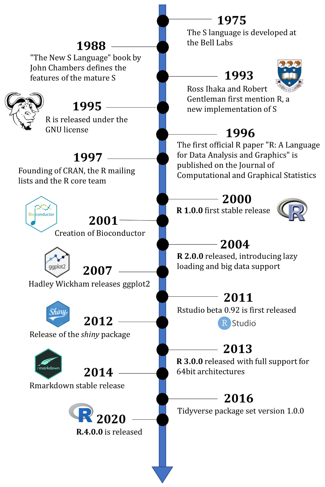
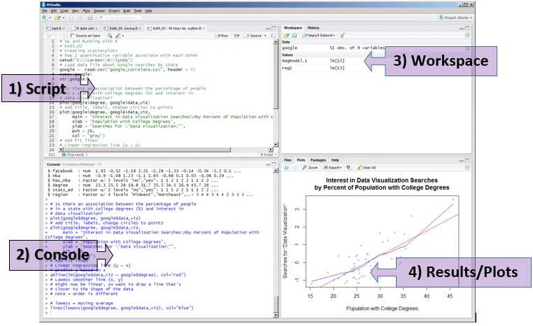

```{r setup, include=FALSE}
knitr::opts_chunk$set(echo = TRUE, include = TRUE, eval = TRUE)

#Load the required packages
packages <- c("bibtex" ,"tidyverse")

invisible(lapply(packages, library, character.only = TRUE))

# Get the packages references
write.bib(packages, "packages.bib")

# merge the zotero references and the packages references
cat(paste("% Automatically generated", Sys.time()), "\n% DO NOT EDIT",
    { readLines("Taller.bib") %>% 
      paste(collapse = "\n") },
    { readLines("packages.bib") %>% 
      paste(collapse = "\n") },
    file = "biblio.bib",
    sep = "\n")
```

```{r message=FALSE, warning=FALSE, include=FALSE}
library(fontawesome)
```

<h1 class="header"><font color="#6F7479">1 </font>R y RStudio</h1>

Las bases del desarrollo de R se remontan a los años 70 cuando en los laboratorios Bell se desarrollo S, un lenguaje de programación para realizar análisis estadísticos.  
**`R`** es un lenguaje de programación orientado a objetos enfocado al análisis estadístico de una diversidad de datos. Sin embargo, las aplicaciones recientes de R incluyen desarrollo de inteligencia artificial y desarrollo web [@giorgiLanguageEngineBioinformatics2022].

```{r, fig.align='center', out.width="600", echo=FALSE}

```
<p class="footnote">Historia del desarrollo de R. Tomada de [@giorgiLanguageEngineBioinformatics2022]</p>

<h2>1.1 RStudio</h2>

RStudio es una interfaz conocido como *entorno de desarrollo integrado* o *IDE* que nos permite interactuar con el lenguaje de programación **R**. La ventana de RStudio se conforma de 4 cuadrantes:

```{r, fig.align='center', out.width="600", echo=FALSE}

```
<p class="footnote">Consola de RStudio. Se muestran los cuatro cuadrantes que componen la ventana de RStudio. Tomada de https://agricolamz.github.io/linguistic_geocomputation_in_r/introduction-to-r-language.html</p>

1. Editor de scripts. El cuadrante que tiene la función de escribir y redactar el código o scripts de nuestros programas. En este cuadrante los comandos **NO** se ejecutan de forma automática al presionar la tecla de *Enter*

2. Consola de R. Es la consola o termnal en donde se está ejecutando el lenguaje R. Aquí los comandos escritos se ejecutan de manera automática al presionar la tecla de *Enter*

3. Entorno de variables. En este cuadrante se almacenan o guardan las variables, funciones u objetos (listas, tablas,...) dervivados de los análisis   

4. Utilidades. Desde este cuadrante podemos accesar a los archivos de nuestra computadora en la pestaña de **Files**; gráficas generadas durante los análisis en la pestaña de **Plots**; lista e información de los paquetes instalados en la pestaña **Packages**; manuales de los programas instalados **Help**

Desde el menú principal puedes crear, salvar o abrir un nuevo script. Asímismo, es posible buscar funciones, comandos u objetos dentro del script dando click en la lupa.

<h2>1.2 Comunidades de R</h2>

Alrededor del mundo existen diferentes comunidades de usuarios con distintos niveles de manejo de R (desde nivel inicial hasta experto). Estas comunidades permiten a los usuarios interactuar entre ellos para la resolución de dudas, la publicación de tutoriales e incluso la organización de cursos y eventos (presenciales o en línea) para llevar a cabo el análisis de distintos tipos de datos.


<li>1. <a href="https://blog.r-project.org/" target="_blank">R-project:</a> Página oficial de R</li>
<li><a href="https://dslcio.slack.com/join/shared_invite/zt-2jwth02fk-KPKe~Wh_j6mzLQJ7m9QrtA#/shared-invite/email" target="_blank">Tidy Tuesday:</a> Comunidad encargada de ublicar flujos de trabajo para la curación de bases de datos. Enfocada en los paquetes de **`tidyverse`**</li>
<li><a href="https://rladies.org/" target="_blank">R-Ladies:</a> Comunidad enfocada en promover la equidad de género dentro del ámbito de la programación. Cuentan con una serie y programa de cursos para que personas (de todos los géneros) practiquen y mejoren sus habilidades en ciencia de datos</li>
<li><a href="https://www.r-bloggers.com/" target="_blank">R-bloggers:</a> Comunidad organizada en blog en donde se publican ejemplos de código, análisis de datos y visualización.

<strong>¿Dónde más puedo buscar ayuda?</strong> Existen comunidades de programadores especializados en otros lenguajes en <a href="https://stackoverflow.com/collectives/r-language" target="_blank">Stackoverflow</a>, <a href="https://www.biostars.org/" target="_blank">BioStars</a> y <a href="https://support.bioconductor.org/" target="_blank">Bioconductor</a> que resuelven problemas de código, intsalación de paquetes o análisis de datos en R para ciencia de datos o bioinformática, respectivamente.


<div class="alert alert-warning">`r fa("triangle-exclamation", fill = "#f9c80e")` Para realizar esta práctica es necesario que tengas instalado [R](https://cran.itam.mx/) y [RStudio](https://posit.co/download/rstudio-desktop/) o bien generes una cuenta en [Positcloud](https://login.posit.cloud/login?redirect=%2F) para hacer uso de la nube.
</div>

<blockquote class="hint">
`r fa("circle-info", fill="#182fdc")` Visita la página de <a href="https://rstudio.github.io/cheatsheets/html/rstudio-ide.html?_gl=1*1yvoblb*_ga*MTA1NDQ2OTQ3Ny4xNzExNDk1MDU2*_ga_2C0WZ1JHG0*MTcxNzEwMDkyOS4yNC4xLjE3MTcxMDExNTUuMC4wLjA." target="_blank">PositCloud</a> para descargar las _cheatsheets_ disponibles para su consulta.
</blockquote>

```{r, echo=FALSE, fig.show='hold', out.width="70%", fig.align='center'}
knitr::include_graphics("../Images/RStudio_cheat.jpg")
```

<div class="next-link">
<a href="../HTML/1.Datos_variables_y_objetos.html">Siguiente</a>
</div>

<h1 class="header"><font color="#6F7479">2</font> Referencias</h1>